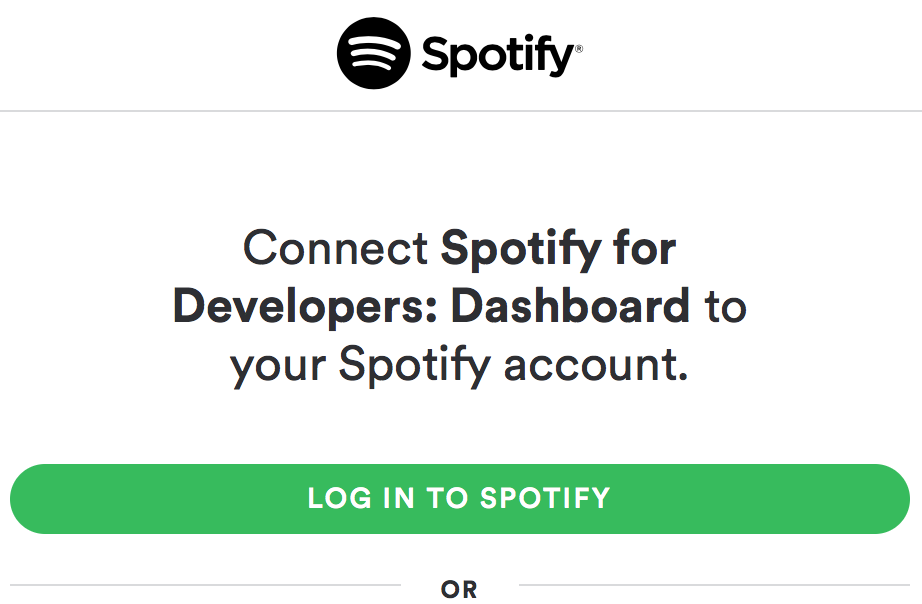

# Gladys Spotify 
Use @GladysProject to Control your Spotify Premium account with Spotify Connect

## Requirements 
1. Have a Spotify developer account
Clic on this link:https://developer.spotify.com[link] and log into the developer space



2. Create a Spotify App
On your link:https://developer.spotify.com/my-applications/#!/applications[developer space], clic on the button « create an app » and follow the instruction.


image::assets/spotify-create-an-app.png[Create an app, width=450, align=center]

3. Set the Redirect URI
Then add your Redirect URI including your RasberryPi address. You can follow this example : https:<your—rpi-ip>_spotify_

image::assets/spotify-app-credentials.png[App credentials, width=450, align=center]

**DON’T FORGET TO SAVE YOUR CONFIGURATION !**


# 2. Installation
From your Gladys interface, go to the « Modules » view, then clic on the « Advanced » tab.

[cols=5*,options=header]
|===
| Name | Version | Depot | Slug | |
Gladys Spotify | 1.0.0 | https://github.com/AdrienDesola/gladys-spotify.git | gladys-spotify | Install
|===

**Click on install**
You don’t need to restart.

# 3. Settings
Clic on this link:https://developer.spotify.com/my-applications[link] in your app to join your app and find your ID.

Again from your Gladys interface, go to the « Settings » view, then clic on the « Settings » tab.

image::assets/spotify-app-credentials.png[spotify app credentials, width=450, align=center]

Fill the settings with the following information 

image::assets/gladys-settings.png[gladys settings, width=450, align=center]

**Finally restart Gladys**

## 4. Initialization of the module


Clic on the « Modules » view and on the button « Set »

After clicking on the button « set » you will receive a notif with a link :
**Allow your Spotify Account by click on this url :***
And follow the instruction. 
If you didn’t receive this notif, check your Gladys’ logs by using the SSH method.

Congratulation your Gladys are configured !
You can test if everything works properly in the « Scripts » view.
```
gladys.music.playPlaylist('spotify:album:4ydl8Ci7OsndhI2ALnrpIv')
```


# Transform your RPI into a Spotify Connect Box image:assets/spotify-setup.png[spotify setup, width=100, height=100]
Connect any RPI device and execute this command :

```
curl -sL https://dtcooper.github.io/raspotify/install.sh | sh
```

As the author would say :
[quote, Raspotify author, raspotify doc]
*Spotify Connect client for the Raspberry Pi that Just Works™.*

link:https://dtcooper.github.io/raspotify/[For more information about Raspotify]