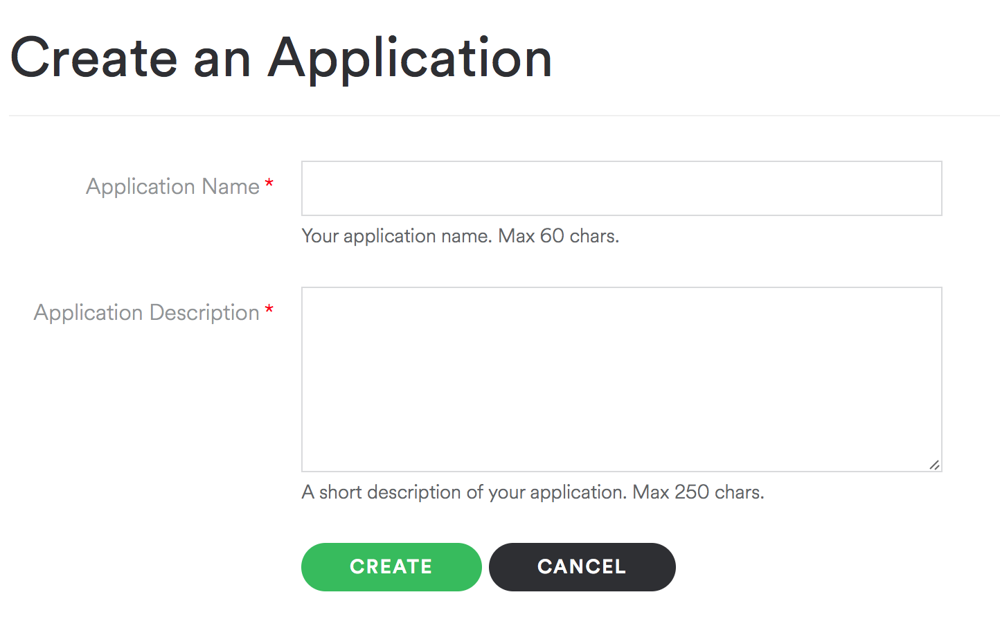
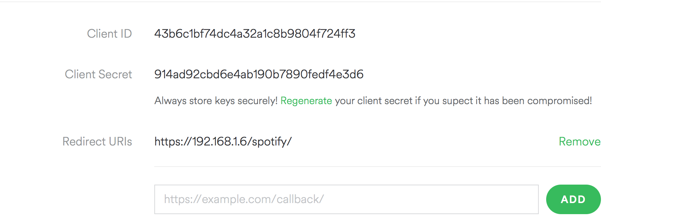
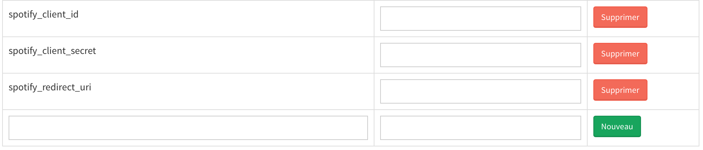

# Gladys Spotify 
Use @GladysProject to Control your Spotify Premium account with Spotify Connect

## Requirements 
1. Have a Spotify developer account
Clic on this [link](https://developer.spotify.com) and log into the developer space


2. Create a Spotify App
On your [developer space](https://developer.spotify.com/my-applications/#!/applications), clic on the button « create an app » and follow the instruction.




3. Set the Redirect URI
Then add your Redirect URI including your RasberryPi address. You can follow this example : https:<your—rpi-ip>_spotify_



**DON’T FORGET TO SAVE YOUR CONFIGURATION !**


# 2. Installation
From your Gladys interface, go to the « Modules » view, then clic on the « Advanced » tab.

| Name | Version | Depot | Slug |	|
|---|---|---|---|---|
Gladys Spotify | 1.0.0 | https://github.com/AdrienDesola/gladys-spotify.git | gladys-spotify | Install

**Click on install**
You don’t need to restart.

# 3. Settings
Clic on this link [in your app](https://developer.spotify.com/my-applications) to join your app and find your ID.

Again from your Gladys interface, go to the « Settings » view, then clic on the « Settings » tab.


Fill the settings with the following information 



spotify_client_id = <Client ID>
spotify_client_secret = <Client Secrect>
spotify_redirect_uri = <Redirect URIs>

**Finally restart Gladys**

## 4. Initialization of the module


Clic on the « Modules » view and on the button « Set »

After clicking on the button « set » you will receive a notif with a link :
**Allow your Spotify Account by click on this url :***
And follow the instruction. 
If you didn’t receive this notif, check your Gladys’ logs by using the SSH method.

Congratulation your Gladys are configured !
You can test if everything works properly in the « Scripts » view.
```
gladys.music.playPlaylist('spotify:album:4ydl8Ci7OsndhI2ALnrpIv')
```


# Transform your RPI into a Spotify Connect Box !
Connect any RPI device and execute this command :

```
curl -sL https://dtcooper.github.io/raspotify/install.sh | sh
```

As the author would say : « Spotify Connect client for the Raspberry Pi that Just Works™. » 

[For more information about Raspotify](https://dtcooper.github.io/raspotify/)

